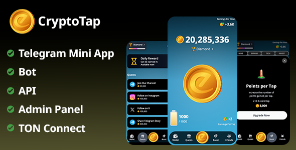

# NotCoin Telegram Bot Clone Source Code, TapSwap, Blum, X Empire, Hamster Kombat, W-Coin Clone [CryptoTap](https://t.me/CryptoTaperBot) 2025

[Play Online Demo](https://cryptotap.datanito.com/)

  

🚀 CryptoTap - A next-level Airdrop Clicker Game with a Telegram Mini App, Bot, and Full API integration! A perfect Notcoin, X Empire, TapSwap, and Blum alternative—better gameplay, more engagement, and a seamless admin experience.

💰 Limited-Time Offer:

## 🔥 $199 for the first 5 buyers!

Regular Price: $799 (Saves you $600) + 3 Months Premium Hosting For Free! optimized for maximum performance and uptime ( Saves you $50 ).

## bot Previews

    
    
    
    
    
    
    
    
    

## admin-panel Previews

  
  
  
  
  

## 🎮 Why Choose CryptoTap? (Telegram Bot Airdrop game source code)

✅ Highly Addictive Gameplay – Keep users engaged with an interactive tap-to-earn system.

✅ Full Telegram Integration – Works flawlessly as a Telegram Mini App & Bot.

✅ Referral & Reward System – Users earn by inviting friends and completing tasks.

✅ Daily Tasks & Airdrop System – Boost user retention with daily challenges.

✅ Complete Admin Panel – No coding required! Manage users, tasks, stats & more.

✅ Full Customization – Change the name, branding, and features as you like.

✅ Optimized Performance – Fast, secure, and built for high user traffic.

✅ Free Hosting for 3 Months – Fully optimized to ensure top performance.

## 🛠 Features & Technology ( Telegram Bot Clicker Game )

Built with: PHP, MySQL, JavaScript, HTML, CSS, Jquery, Ajax and etc.

User Authentication via Telegram – No fake users, full verification system.

DDoS Protection – Secured with Datanito Cloud or Cloudflare.

Task System – Support for JoinChat, VisitWebsite, and more.

Live Statistics & Analytics – View user engagement, earnings, and activity.

Automated Database Backups – Never lose important data.

Maintenance Mode – Temporarily disable the bot when needed.

## 📌 Admin Panel Features

🔹 User Management – Search, edit, and control all users.

🔹 Task Management – Create and manage missions with ease.

🔹 Referral Tracking – Monitor user invites and bonuses.

🔹 Customization Panel – Adjust game settings, rewards, and branding.

🔹 Performance Monitoring – Ensure smooth operation with real-time stats.

## 💲 Pricing

🎯 Special Offer: First 5 buyers get it for $199 (then back to $399).

💎 Includes: Full script, admin panel, Telegram bot codes, API integration, and 3 months of free hosting.

📛 NO SCAMMERS – Serious buyers only! 📛

## 🚀 Get It Now!

📩 Contact on Telegram: @milad_saraf

📢 View Our Website for more software and solutions: https://datanito.com

## 🔥 License & Contribution

License: MIT License – Modify and use it as you wish (not reselling allowed).

Contributions: Open to improvements and feature requests!

Take action now and launch your own Telegram Clicker Game today! 🚀
